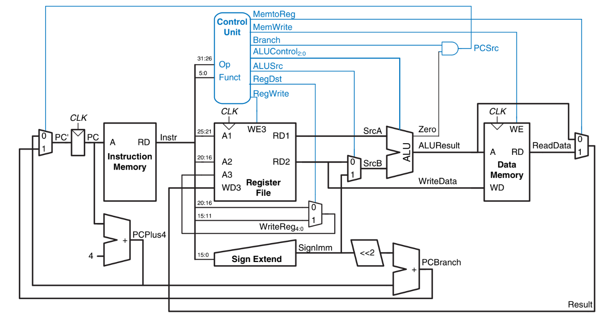
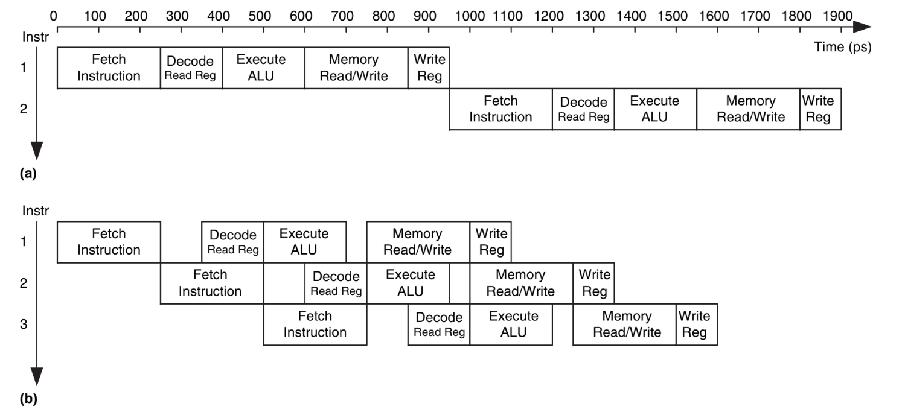
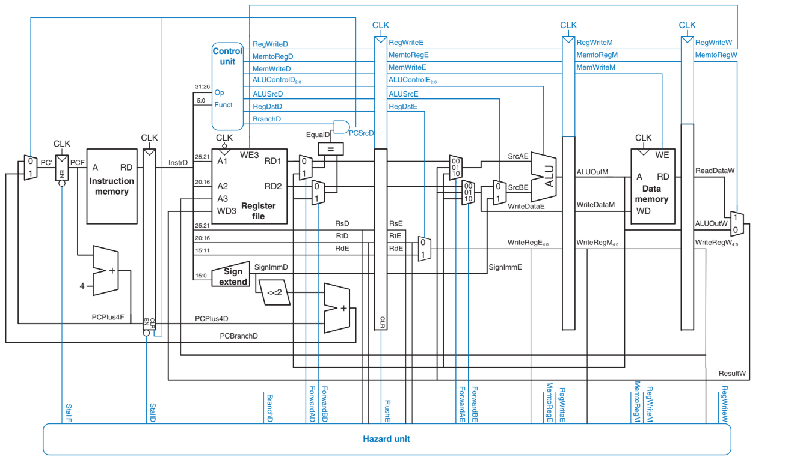

# RISCape

A 5-stage pipelined RISC-V processor implementing the RV32I base ISA.

## Overview

RISCape is a fully pipelined RISC-V CPU designed with five stages: **Fetch**, **Decode**, **Execute**, **Memory**, and **Writeback**. It supports:

- All RV32I instructions
- Hazard detection and forwarding
- Memory-mapped instruction/data memory
- Register file with three-port access
- Simple test program execution

## Architecture Diagrams

#### Single-Cycle CPU Block Diagram



#### Single-Cycle vs Pipelined Timing Diagram



#### Pipelined CPU Block Diagram



### Example Program

A test program in RISC-V assembly is compiled to machine code (`example.txt`) and loaded into instruction memory. It performs various arithmetic, logic, branch, and memory operations. On successful execution, the value `0xABCDE02E` is stored at memory address `0x84`.

### Directory Layout

```RISCape/
├── docs/ # Images, diagrams, and documentation (ehhh documentation i forgor)
│   ├── pipelined.png
│   ├── single_cycle.png
│   └── timing_diagram.png

├── src/         # All SystemVerilog source files (modules)
│   ├── alu.sv
│   ├── datapath.sv
│   ├── controller.sv
│   ├── top.sv
│   └── ...

├── tb/          # Testbenches for important modules
│   ├── alu_tb.sv
│   ├── top_tb.sv
│   └── ...

├── test/        # Test programs and memory files
│   ├── example.txt       # Program memory in hex (for imem)
│   └── test.asm          # Original assembly file
├── README.md 
```


### Simulation Instruction
You can simulate using any SystemVerilog simulator (Vivado, ModelSim, etc.):

1. **Run** `top.sv` with `top_tb.sv`.
    
2. **Load** `example.txt` into `imem`.
    
3. **Observe** memory writes to verify correct execution (`mem[132] = 0xABCDE02E`).
    
---

### Installing Ripes (Visual Debugger)

[Ripes](https://github.com/mortbopet/Ripes) is a visual simulator for RISC-V pipelines.

#### Linux / macOS:

```bash
git clone https://github.com/mortbopet/Ripes.git
cd Ripes
mkdir build && cd build
cmake ..
make -j$(nproc)
./Ripes
```

#### Windows:

> Download prebuilt binaries from the [Ripes GitHub Releases](https://github.com/mortbopet/Ripes/releases)

---
### Installing RISC-V GCC Toolchain

You can use this to write C code and compile it to RISC-V assembly and machine code.
#### Ubuntu / Debian (APT-based):


`sudo apt update sudo apt install gcc-riscv64-unknown-elf`

#### Arch-based (If you are non-grass toucher like me):

`sudo pacman -S riscv64-elf-gcc riscv64-elf-binutils`

This installs the `riscv64-elf-*` toolchain (i.e., the compiler, assembler, linker, and binutils).

#### From Source (Portable, Cross-platform):


```bash
git clone https://github.com/riscv-collab/riscv-gnu-toolchain
cd riscv-gnu-toolchain
./configure --prefix=$HOME/riscv --with-arch=rv32i --with-abi=ilp32
make newlib
export PATH="$HOME/riscv/bin:$PATH"
```

This will build the RV32I toolchain using `newlib` (a lightweight C library suitable for embedded systems).

---

### Sample Compile and Conversion Flow

Given a file `prog.c`, you can compile and convert it to a Verilog-compatible memory file (`.hex`):

```bash
riscv64-unknown-elf-gcc -march=rv32i -mabi=ilp32 -nostdlib -T linker.ld -o prog.elf prog.c
riscv64-unknown-elf-objcopy -O verilog prog.elf example.txt
```

If you're using assembly directly:

```bash
riscv64-elf-as -o prog.o prog.s
riscv64-elf-ld -o prog.elf prog.o
riscv64-elf-objcopy -O verilog prog.elf prog.hex
```

#### Windows Users

- Download a prebuilt toolchain from: [https://github.com/sifive/freedom-tools/releases](https://github.com/sifive/freedom-tools/releases)
- Extract it and add the `bin/` folder to your system `PATH`
- You may also use WSL (Windows Subsystem for Linux) or a simulator that accepts `.hex` or `.mem` files as input. 